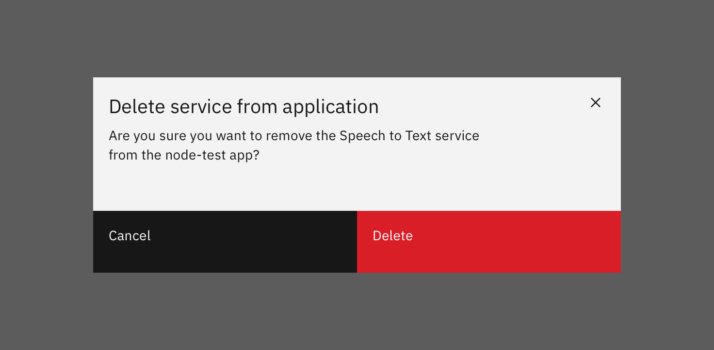

import ComponentCode from '../../../../src/components/ComponentCode';
import ComponentDocs from '../../../../src/components/ComponentDocs';

<AnchorLinks>
<ul>
    <li><a data-scroll href="#general-guidance">General guidance</a></li>
    <li><a data-scroll href="#variations">Variations</a></li>
    <li><a data-scroll href="#labels">Labels</a></li>
    <li><a data-scroll href="#icon-usage">Icon usage</a></li>
    <li><a data-scroll href="#danger-button-usage">Danger button usage</a></li>
</ul>
</AnchorLinks>

## General guidance

_Buttons_ express what action will occur when the user clicks or touches it. Buttons are used to initialize an action, either in the background or foreground of an experience.

Buttons are used primarily on action items. Some examples include **Add**, **Save**, **Delete**, and **Sign up**. Each page can have one or two **primary** buttons. Any remaining calls-to-action should be represented as secondary buttons.

Do not use buttons as navigational elements. Instead, use [links](/components/link) when the desired action is to take the user to a new page.

## Variations

| Button type      | Purpose                                                                                                                                                                                                                                                                                                                                                                           |
| ---------------- | --------------------------------------------------------------------------------------------------------------------------------------------------------------------------------------------------------------------------------------------------------------------------------------------------------------------------------------------------------------------------------- |
| _Primary_          | For the principal call to action on the page.                                                                                                                                                                                                                                                                                                                                     |
| _Secondary_        | For secondary actions on each page.                                                                                                                                                                                                                                                                                                                                               |
| _Button with icon_ | When words are not enough, icons can be used in buttons to better communicate what the button does. Icons are always paired with text.                                                                                                                                                                                                                                            |
| _Disabled button_  | Use when the user cannot proceed until an input is collected.                                                                                                                                                                                                                                                                                                                     |
| _Set of buttons_   | When an action required by the user has more than one option, always use a a negative action button (secondary) paired with a positive action button (primary) in that order. Negative action buttons will be on the left; positive action buttons on the right. When these two types of buttons are paired in the correct order, they will automatically space themselves apart. |
| Small button     | Use when there is not enough vertical space for a regular sized button.                                                                                                                                                                                                                                                                                                           |
| _Ghost button_     | When an action does not require primary dominance on the page.                                                                                                                                                                                                                                                                                                                    |
| _Danger button_    | When an action has potentially destructive effects on the user's data (delete, remove, etc).                                                                                                                                                                                                                                                                                      |

## Labels

Button labels should clearly indicate the action of the button. Use active verbs, such as **Add** or **Delete**. Use sentence-style capitalization (only the first word in a phrase and any proper nouns capitalized) and no more than three words for button labels.

For sets of buttons, use specific labels, such as **Save** or **Discard**, instead of using **OK** and **Cancel**. This is particularly helpful when the user is confirming an action.

For consistency, see [labels and idioms](/guidelines/content/glossary) for the approved list of action labels.

## Icon usage

- Use glyphs (16px) within buttons.
- Glyphs are distinguished by their solid shape and knocked-out details.
- Glyphs should always appear to the right of the text.
- Glyphs used in buttons must be directly related to the action that the user is taking.
- Glyphs must be the same color value as the text within a button.
- Ghost buttons require a glyph icon.

<ImageComponent  cols="8" caption="Glyph usage in Buttons">

</ImageComponent>

## Danger button usage

Danger buttons have a different visual style to inform users of potentially destructive actions they are about to take. If using the danger button as a standalone, we recommend styling it as a **secondary button**. Within a set, the danger button should be styled as a **primary button.**

<ImageComponent cols="8" caption="Danger button set">

</ImageComponent>
