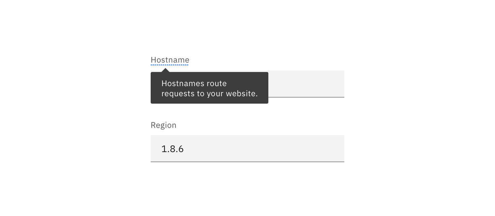
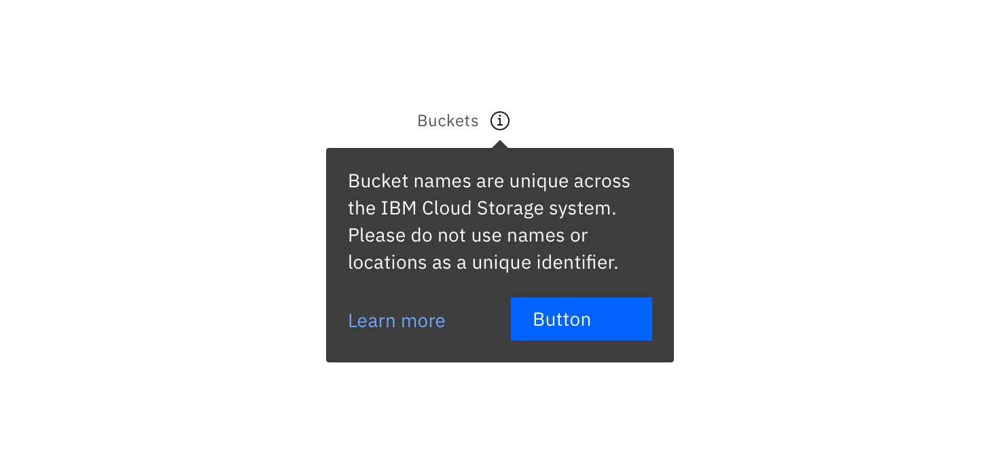

import ComponentCode from '../../../../src/components/ComponentCode';
import ComponentDocs from '../../../../src/components/ComponentDocs';

## General guidance

_Tooltips_ provide additional information upon hover or focus. They often contain helper text that is contextual to an element.

#### Icon tooltip

An icon tooltip is used to clarify the action or name of an interactive icon button. The tooltip content should only contain one to two words. Icon tooltips appear on `hover` and `focus`.

<ImageComponent cols="8"  caption="Icon tooltip used to clarify the action or name of an interactive icon button.">

</ImageComponent>

#### Definition Tooltip

The primary purpose of a definition tooltip is to provide additional help or define an item or term. Therefore, they should contain read-only text that is kept to a minimum. The use of interactive elements, such as buttons or links, is discouraged. Definition tooltips appear on `hover` and `focus`.

<ImageComponent cols="8"  caption="Definition tooltip used to define a Form label.">

</ImageComponent>

#### Interactive Tooltip

The primary purpose of a definition tooltip is to provide additional help or define an item or term. Therefore, they should contain read-only text that is kept to a minimum. The use of interactive elements, such as buttons or links, is discouraged. Definition tooltips appear on `hover` and `focus`.

Interactive tooltips can contain text and other interactive elements such as a button or a link. They appear when the user clicks on an info icon and are persistent until intentionally dismissed by clicking outside of the tooltip.

<ImageComponent cols="8"  caption="Example of an interactive tooltip.">

</ImageComponent>
