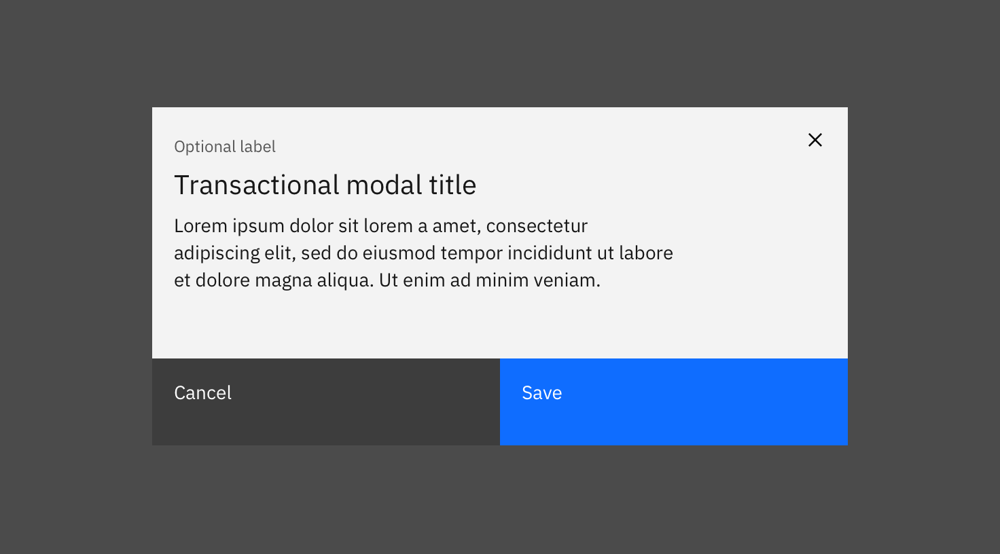
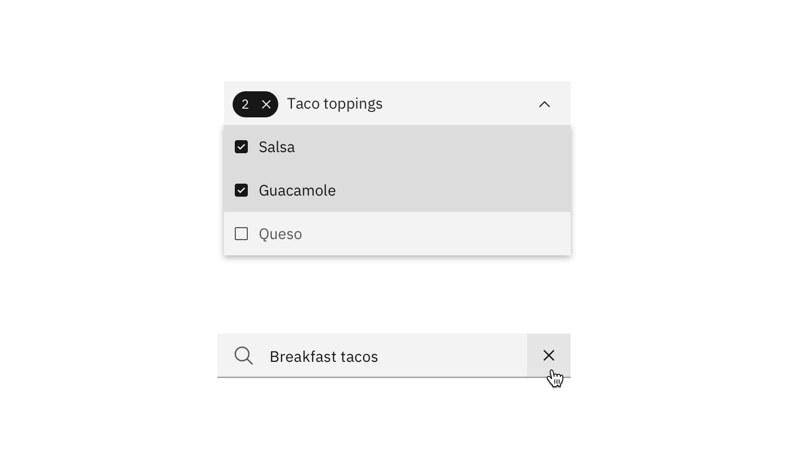
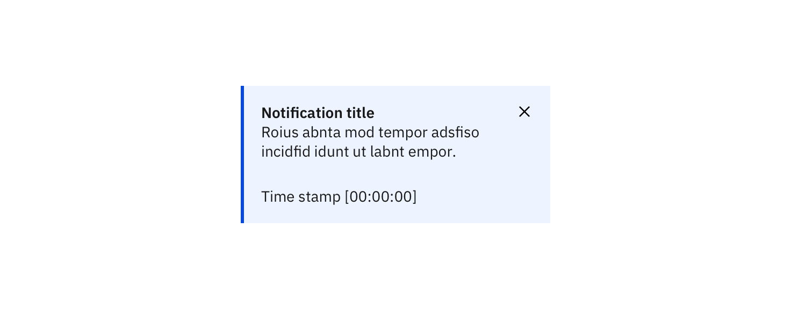
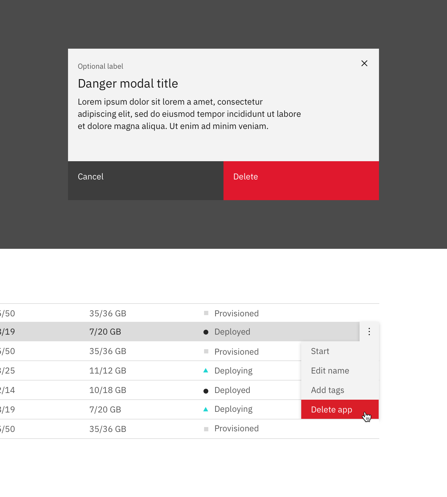
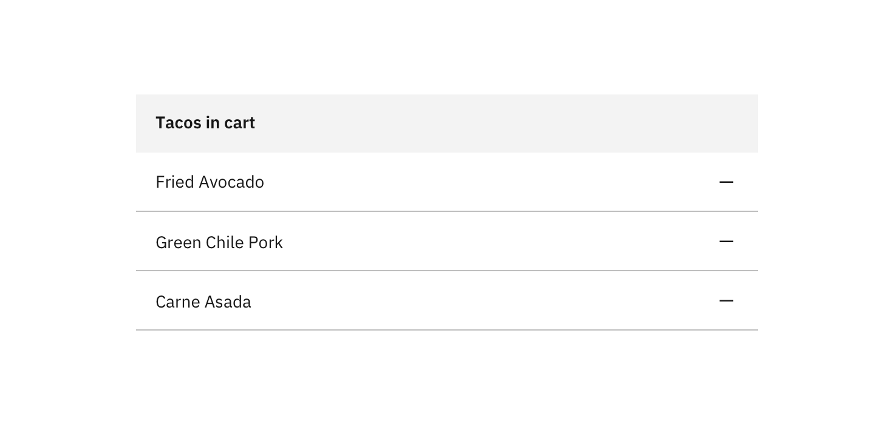
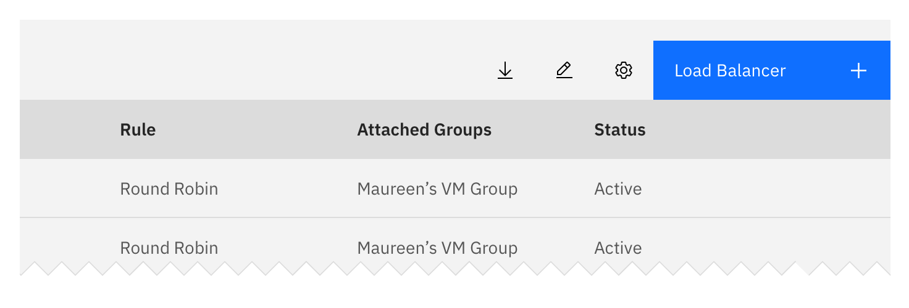
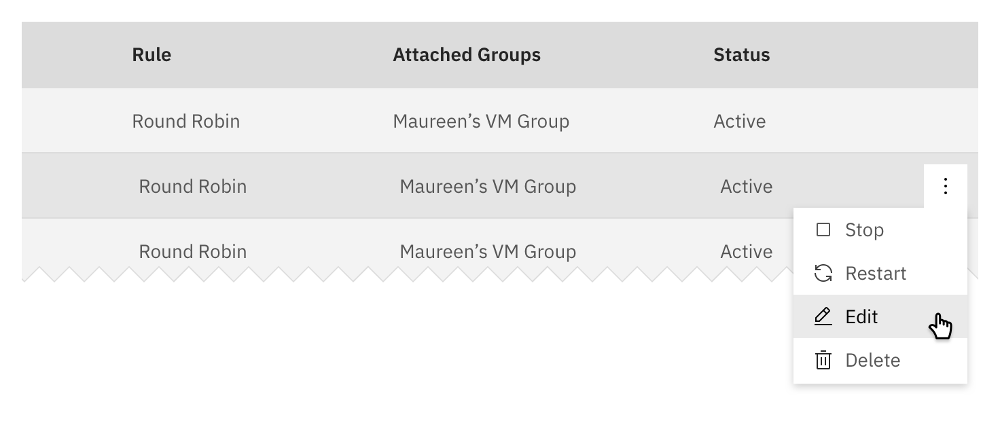
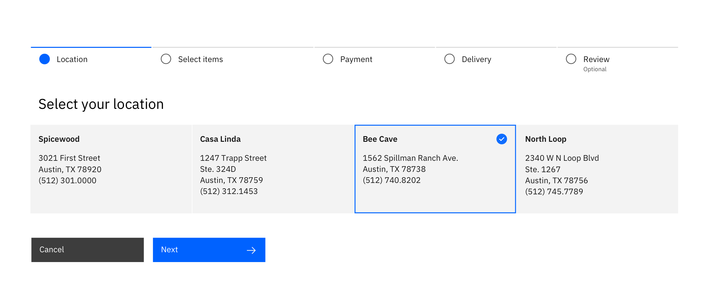
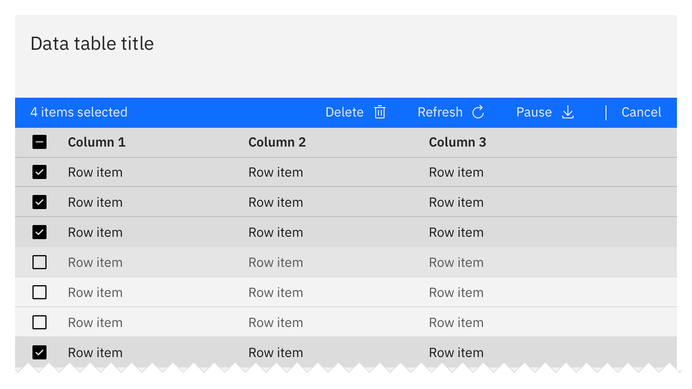

<AnchorLinks>
<ul>
    <li><a href="#purpose">Purpose</a></li>
    <li><a href="#regressive-actions">Regressive actions</a></li>
    <li><a href="#progressive-actions">Progressive actions</a></li>
</ul>
</AnchorLinks>

## Purpose

Common actions are frequently used actions that appear multiple times across different components and workflows. For platform consistency, these actions should only be applied in the ways described below.

## Regressive actions

<AnchorLinks small="true">
<ul>
    <li><a href="#cancel">Cancel</a></li>
    <li><a href="#clear">Clear</a></li>
    <li><a href="#close">Close</a></li>
    <li><a href="#delete">Delete</a></li>
    <li><a href="#remove">Remove</a></li>
    <li><a href="#reset">Reset</a></li>
</ul>
</AnchorLinks>

### Cancel

Cancel stops the current action and closes the component or item. The user should be warned of any possible negative consequences of stopping an action from progressing, such as data corruption or data loss.

**Usage:** Use a _secondary button_ or a _link_.

<ImageComponent cols="8" caption="“Cancel” action as a button.">

</ImageComponent>

### Clear

This action clears data from fields or removes selections. _Clear_ can also delete the contents of a document, such as a log. Typically, the default selection or value is reset for controls that have a default selection or value, such as radio buttons.

**Usage:** Use the `x` icon on the right side of a field, item, or value.

<ImageComponent cols="8" caption="“Clear” action in multi-select dropdown and in search.">

</ImageComponent>

### Close

This action closes the current page, window, or menu. One example is closing a secondary window containing help. _Close_ is also used to dismiss information, such as notifications.

**Usage:** Use the `close` icon, which is typically placed on the upper right side of the element. Do not use _close_ in a button.

<ImageComponent cols="8" caption="“Close” action in an inline notification.">

</ImageComponent>

### Delete

This action eradicates an existing object. _Delete_ actions cannot be easily undone and are typically permanent. The user should be warned of the negative consequences of destroying an object, such as loss of data.

**Usage:** Use either the `delete` "trash can" icon, a _danger button_, or a danger option in a menu. A _danger modal_ is used when a warning is needed to confirm an action.

<ImageComponent cols="8" caption="“Delete” action in a modal (top) and an overflow menu (bottom).">

</ImageComponent>

### Remove

This action removes an object from a list or item; however, the object is not destroyed as a result of the action. Multiple objects can be removed at once.

**Usage:** Use as a _button_ or `subtract` icon or glyph.

<ImageComponent cols="8" caption="“Remove” action as an icon.">

</ImageComponent>

### Reset

This action reverts values back to their last saved state. The last saved state includes the values stored the last time the user clicked or triggered "Apply."

**Usage:** Typically applied as a _link_.

<ImageComponent cols="8" caption="“Reset” action in a filter.">

</ImageComponent>

## Progressive actions

<AnchorLinks small="true">
<ul>
    <li><a href="#add">Add</a></li>
    <li><a href="#copy">Copy</a></li>
    <li><a href="#edit">Edit</a></li>
    <li><a href="#next">Next</a></li>
    <li><a href="#refresh">Refresh</a></li>
</ul>
</AnchorLinks>

### Add

This action adds an existing object to a list, set, or system. For example, adding a document to a folder.

**Usage:** Use a _primary button_, _button with icon_, `add--glyph` or `add--outline` icon.

<ImageComponent cols="8" caption="“Add” action in a button with icon in a data table.">

</ImageComponent>

### Copy

Creates a new identical instance of the selected object(s) in a specific destination.

**Usage:** Use the `copy` icon with the confirmation "copied" tooltip appearing post-click.

<ImageComponent cols="8" caption="“Copy” action as an icon with tooltip in a code snippet.">

</ImageComponent>

### Edit

This action allows data or values to be changed. _Edit_ commonly triggers a state change to the targeted object or input item.

**Usage:** Use as an option in a menu, or as a _button_ or `edit` icon.

<ImageComponent cols="8" caption="">

</ImageComponent>

<ImageComponent cols="8" caption="Example of “edit” options for a data table cell and overflow menu.">

</ImageComponent>

### Next

Advances the user to the next step in a sequence of steps, such as in a wizard.

**Usage:** Use a _button with icon_ or a standalone `forward` icon.

<ImageComponent cols="12" caption="“Next” action as a button with icon in a wizard.">

</ImageComponent>

### Refresh

This action reloads the view of an object, list, or data set when the displayed view has become unsynchronized with the source.

**Usage:** Use the `refresh` icon or a _button_.

<ImageComponent cols="8" caption="“Refresh” action as a ghost button with icon in the action bar of a data table.">

</ImageComponent>

